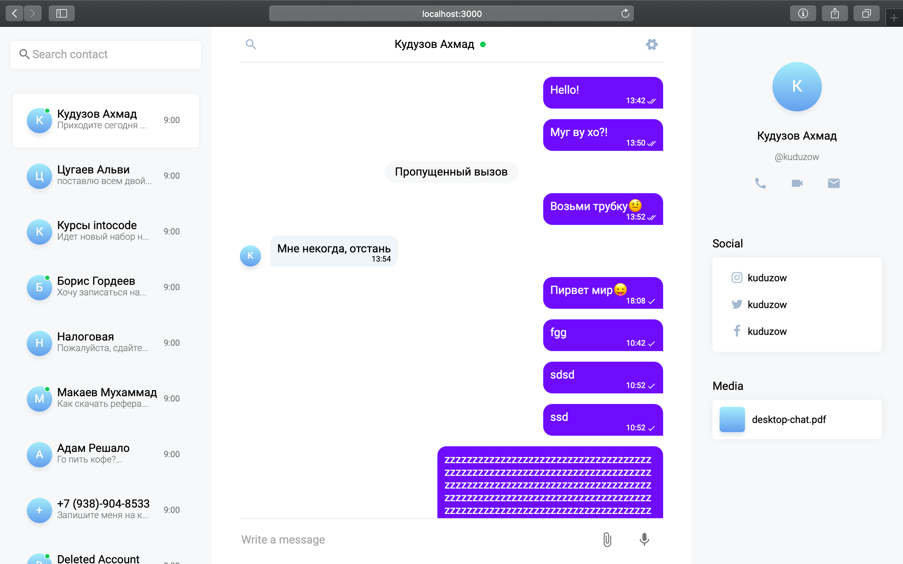

# Разработка чата

## Summary

Задача данного челленджа – разработка веб-чата с возможностью поулчения/добавления сообщений и списка контактов.

Челлендж рассчитан на командную разработку (3-4 человека).

Каждый участник команды должен записывать задачи, которые он выполнял – это понадобится при составлении резюме.

Также нужно записывать все проблемы, с которыми вы столкнулись во время разработки и то, как эта проблема была решена. В конце этот список нужно скинуть наставнику.

При разбивке задач между командой нужно предусмотреть, чтобы каждый участник успел поработать с разными видами задач: проектирование, верстка, работа с компонентами и с редьюсерами.

## Releases

Прежде чем начать разработку определите тимлида своей команды.

Тимлид должен склонировать данный репозиторий и выгрузить его копию на свой профиль гитхаб. После этого остальные участники команды делают форк его репозитория и клонируют его к себе.

После этого внимательно изучите все заготовленные редьюсеры и компоненты (или папки для компонентов).

Подумайте зачем нужен каждый файл и какой код будет в нём содержаться.

Обговорите это внутри своей команды. Каждый из вас должен одинаково видеть и понимать конечную цель разработки.

Обсудите сложности, которые могут возникнуть во время разработки и способы их решения.

### Release 0. Макет

В этом релизе поработайте над внешним видом приложения. В первую очередь тимлид должен сверстать общий макет с тремя блоками, чтобы другие участники затем могли приступить к верстке своих блоков внутри макета.

Примерный внешний вид чата должен быть таким:



⚠️ Помни, что в данном релизе готовится только внешний вид чата, а не функционал.

Постарайтесь разбить компоненты на небольшие кусочки, чтобы в дальнейшем их легче было дорабатывать.

### Release 1. Связь с сервером

Когда внешний вид чата будет готов можно переходить к получению данных с сервера.

Вам доступны следующие ресурсы на сервере `https://api.intocode.ru:8001/api`:

| Ресурс                           | Назначение                                           |
| -------------------------------- | ---------------------------------------------------- |
| GET /profile                     | Получить инфу о профиле                              |
| GET /contacts                    | Получить список контактов                            |
| GET /messages/`myId`/`contactId` | Получить список сообщений между `myId` и `contactId` |
| POST /messages                   | Добавление сообщения                                 |
| DELETE /messages/`id`            | Удалить сообщение по ID                              |

#### Ключевые моменты

➡️ Данные с роута `/profile` необходимо сохранить в редьюсер `application`.
Особое значение имеет ключ `_id` из этого профиля. Он нужен для определения направления сообщения. Если ключ `toUserId` из объекта сообщения будет совпадать с ID профиля, то значит это входящее сообщения от `fromUserId`, если наоборот, то исходящее.

➡️ Пользуйся программой Postman, чтобы проверить какие ключи с какими значениями приходят с сервера.

➡️ При добавлении сообщения через `POST /messages` отправляй на сервер в теле запроса все необходимые ключи для нового сообщения.

Разбейте задачи по редьюсерам, тогда каждый участник команды будет работать над отдельной фичей проекта. Редьюсер `application` имеет минимальный функционал, поэтому разработчик, который работает с этим редьюсером может взять на себя часть задач из другого редьюсера заранее обговорив это с другими участниками.

### Release 2. Добавление роутинга

При клике на контакт должна происходить смена роутинга – в конец адреса будет добавляться id открытого контакта.

Часть приложения, которая отвечает за вывод сообщений, в свою очередь, должна отзываться на это изменение, запрашивать нужные данные у сервера и выводить полученный список сообщений.

### Release 3. Отправка сообщений

Доработайте чат таким образом, чтобы:

- после открытия чата внизу страницы должна быть форма ввода сообщения;
- справа от формы должна быть иконка микрофона;
- если в поле ввода что-то ввели иконка должна поменяться на иконку отправки;
- если поле очистили должен вернуться микрофон;
- при нажатии на иконку отправки сообщение должно отправиться на сервер;
- после добавления сообщение должно появиться в конце списка сообщений;
- должен произойти автоматический скроллинг на последнее сообщение.

### Умная отправка сообщений\*

Данное с высоким уровнем сложности. Его нужно выполнить только в том случае, если с другими заданиями не было больших трудностей.

Задача заключается в том, что пользователь после отправки сообщений должен видеть статус отправки:

- сразу после отправки сообщения оно должно появиться в конце списка сообщений с иконком таймера;
- как только сообщение дойдет на сервер и будет получен ответ об успешном добавлении нужно иконку заменить на галочку.

Реализуется данная задача по следующему алгоритму:

**1. В санке перед отправкой сообщения на сервер генерируется временный id.**

Временный id нужен из-за того, что реальный id сообщения становится доступны только после добавления сообщения на сервере.

Сгенерировать временный id можно разными способами. Подойдет к примеру функция `Math.random()`, которая генерирует случайное число.

**2. Сообщение добавляется в редьюсер, но в объекте сообщения должны дополнительно присутствовать ключи `sending` равный `true` и `tempId` равный временному id.**

**3. Доработать компонент с выводом сообщения.**

Если свойство `sending` равно `true`, то вместо галочки нужно вывести иконку таймера.

**4. После получения ответа с сервера нужно заменить ключ `sending` на `false`.**

Для того чтобы узнать у какого именно сообщения должна произойти замена следует обращаться по временному id.

В редьюсере при помощи `.map()` перебирается весь массив сообщений и как только произойдет совпадение `action.payload.tempId` с айди текущего элемента возвращается новый объект сообщений с измененными ключами.

**Псевдокод для санка:**

```
dispatch => {
  tempId = случайный ид

  dispatch({ ... payload: { tempId: tempId, ...остальные ключи сообщения} })

  fetch(...)
    ...
    .then((data) => {
      dispatch({ ... payload: { tempId: tempId, data: data }})
    })
}
```

**Псевдокод для редьюсера:**

```
return {
  ...state,
  messages: state.messages.map(item => {
    если item.id совпал с action.payload.tempId то
      вернуть объект сообщения из payload.data
    иначе вернуть item как есть
  }
}
```

### Release 4. Прочие удобства

В данном релизе добавьте несколько фичей, которые позволят пользоваться чатом более удобно:

- при открытии сообщений должен происходить скроллинг по последнего сообщения;
- должна быть форма фильтрации контактов;
- должна быть форма фильтрации сообщений;
- блок анкеты справа должен скрываться/раскрываться по нажатию на соответствующую иконку.

### Release 5. Анимации и прелоадеры

Добавьте в чат анимации, которые сделают пользование чатом не только удобным, но и красивым.

Также необходимо добавить прелоадеры для всех запросов на сервер.

### Release 6. Code refactoring

Сделайте код-ревью приложения:

- проверьте все ли функции работают как надо;
- уберите все ненужные запросы на сервер;
- консоль должен быть чистым;
- не должно быть повторяющихся участков кода;
- не должно быть неиспользуемого кода;
- соответствует ли код принятому стайл гайду?
- прописаны ли пропс-тайпы для всех компонентов?

## Заключение

Готовый проект должен быть выгружен на Хероку.
